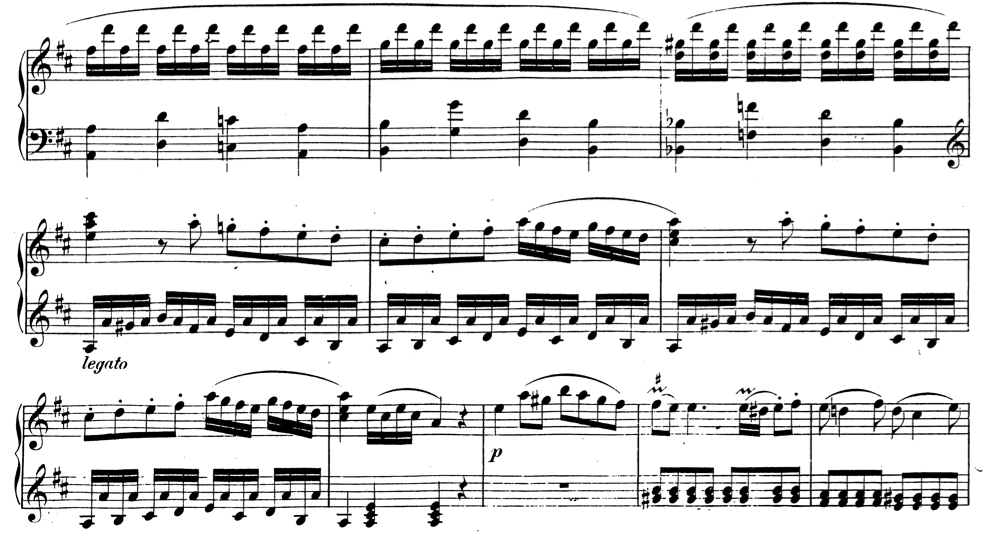

A sonata exposition has two structural arrival points, all associated with, but not equivalent to, cadential arrivals.

## Medial caesura (MC)

James Hepokoski and Warren Darcy (whose theory forms the basis of these reference materials) recommend that when analyzing a sonata exposition, "the first task [is] to locate and identify the treatment of the _MC_" (p. 24). In a two-part exposition the moment marks the end of the part one of the exposition and thus indicates the imminent arrival of the subordinate theme, which begins part two. Prepared by energy that has been gained in the transition zone (TR), the MC is a rhetorical break–quite often a rest or silence–that dissipates the transition's energy, opening "space" for the onset of S. The first step in locating in an MC is to look for this break, which is often as simple as finding rests immediately before music in the subordinate key.

Medial caesuras are always associated with a cadence–most often a half cadence. Though importantly, *MCs are not cadences* in themselves. Typically, the transition module leads to an HC, and a "[standing on the dominant](internalExpansions.html)" is used to gain energy that will culminate in the MC. (H/D call this a "dominant lock.") Occasionally — especially in slow movements or shorter movements — the MC and structural HC will occur at the same time, though technically, they are not the same thing!

In the following example (from Mozart's Piano Sonata in D major, K. 284), the transition's continuation reaches an HC at the beginning of the second line (marked legato). The dominant is prolonged via a "standing on the dominant," and the MC is reached 5 measures later, marked by "three hammer blows" in the left hand and a one-beat silence.

**Mozart Piano Sonata in D major, K. 284, i**

<iframe src="https://embed.spotify.com/?uri=spotify:track:2DuicS9kJJcP1sIyIGxGpE" width="300" height="80" frameborder="0" allowtransparency="true"></iframe> 

As mentioned, the most common cadence associated with an MC is a half cadence. Typically, the HC occurs either in the home key, which we will call a I:HC MC, or the secondary key, a V:HC MC or III:HC MC. 

These musical characteristics often lead to an MC, and are associated with the transition module (discussed below):

* *energy gain* leading into the HC;
* a continuous maintaining of energy between the HC and the MC.
* a pause or break in the musical texture at the MC (sometimes *filled* by a single voice or other greatly reduced texture—what H/D call "caesura fill");

Other common, but by no means required, features are:

* *fa–fi–sol* in the bass (or sometimes, *le–sol*), leading into the HC;  
* a thrice-repeated chord of arrival immediately preceding the break (what H/D call "hammer blows").

*For an MC to be a real MC, it must be followed by a satisfactory subordinate (S) theme* (see below). A cadence that otherwise could function as an MC, but is not followed by a satisfactory S theme, is considered a case of "medial caesura declined," or could indicate the presence of a continuous exposition.

## Essential expositional closure (EEC)

In the exposition of a sonata movement, the EEC is "the first satisfactory PAC within the [subordinate] key that goes on to differening material" (Hepokoski/Darcy, p. 18). It is *not* optional, and it is _always_ in the subordinate key. In a major mode, it will nearly always be a V:PAC, and in the minor mode, it is most often a III:PAC. The closing zone (C) immediately follows the EEC.

Two features of the EEC are of great importance: (1) it coincides with the _first_ satisfactory PAC, and (2) it is followed by _differing_ material. _Often, the rhetorically strongest PAC in the dominant is not the EEC_.

Once the PAC has been achieved, any new material is part of a _closing zone (C)_, as it is no longer under the purview of _S_.

