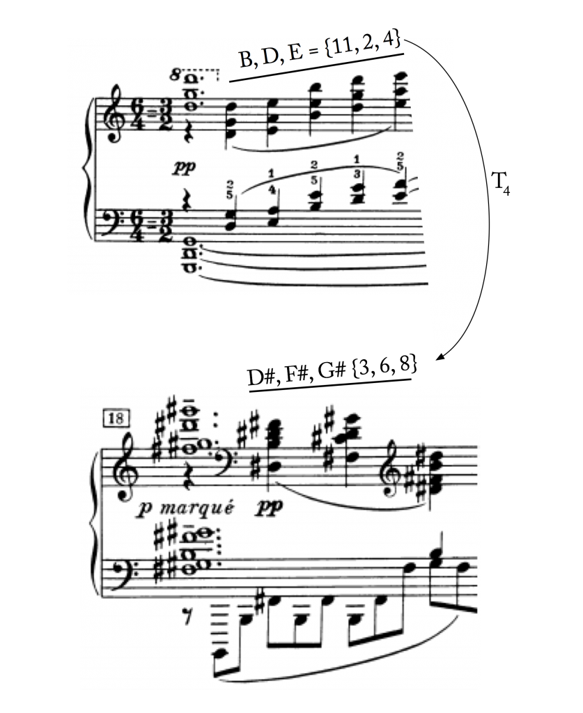

In post-tonal music, transposition is often associated with motion: Take a chord, motive, melody, and when it is transposed, the aural effect is of *moving* that chord, motive, or melody in some direction. That’s the effect here, in two disconnected passages from Debussy's, *La cathédrale engloutie*:

The opening motive — comprising the notes B, D, E, or {11, 2, 4} — is transposed four semitones higher in m. 18, representing the cathedral’s slow ascent above the water. Transposing something preserves its intervallic content, and not only that, it preserves the specific arrangement of that thing’s intervals. When we hear the passage at m. 18 above, we recognize its relationship to the passage in m. 1 because the same intervals return, but starting on a different pitch.

Transposition is an operation — something that is *done* to a pitch, pitch class, or collection of these things — or alternatively a *measurement* — representing the distance between things. We represent it as *Tn*, where *n* represents the ordered pitch-class interval between the two things. To transpose something by *Tn*, add *n* to every element in that thing (mod 12). Given the collection of pitch classes in m. 1 above and transposition by *T4*:

The result is the pitch classes in m. 18. *T4* {11, 2, 4} = {3, 6, 8}.

Alternatively, to determine the transpositional relationship *between* two things, subtract the first thing from the second. If the numbers that result are all the same, the two things are related by that *Tn*.

This is how I arrived at the *T4* arrow label in the musical example above, by “subtracting” the pitch class integers of m. 1 from the pitch-class integers in m. 18.
